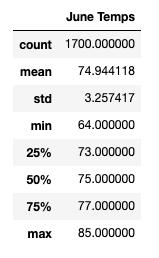

# Surf's Up Analysis

## Overview

  This analysis was intended to provide W. Avy with weather knowledge when considering opening a surf/ice cream store. Since surfing and eating ice cream are activities that rely on having warm weather conditions, the temperature statistics matter when considering whether to open this store. Since June and December represent the beginning months of summer and winter, our analysis specifically focused on the summary statistics for these 2 months betweeen 2010 and 2017. 

## Results
* As one might expect, the average temperature in June in this Hawaiian city is marginally higher than the average temperature in December. Specifically, the mean June temperature (74.9˚) is about one standard deviation higher than the mean December temperature (71.0˚). 
* While June averages higher temperatures than December, there is a higher variance or spread in temperatures for December. The interquartile range is also slightly larger for December, but the difference between the max and min temperatures is more significant.  
* There are noted differences between the June and December temperatures, but they are very similar for the most part. This makes sense since there is little variation in Oahu's climate, especially compared to more northern cities in the continental US. We would expect December to be slightly lower, but having an average temperature of 71˚ in the month of December would seem warm enough to keep a year-round surfing/ice cream shop open.  

